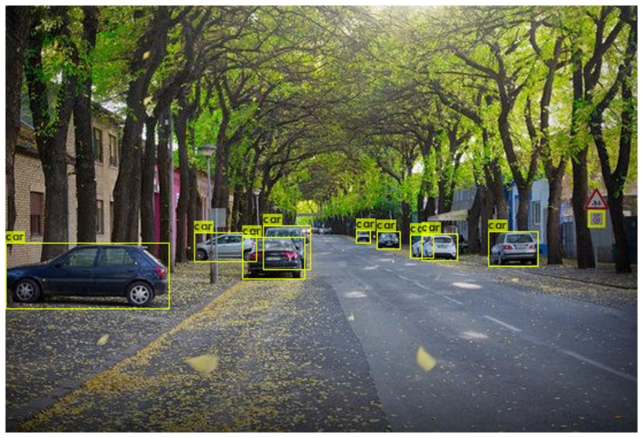

Step 1: Enabling GPU within your notebook

      You will want to enable GPU acceleration within your Colab notebook so that your YOLOv4 system will be able to process detections over 100 times faster than CPU.
      Edit--> Notebook setting-->Click GPU-->Save

Step 2: Cloning and Building Darknet

    The following cells will clone darknet from AlexeyAB's famous repository, adjust the Makefile to enable OPENCV and GPU for darknet and then build darknet.

Step 3: Download pre-trained YOLOv4 weights

      YOLOv4 has been trained already on the coco dataset which has 80 classes that it can predict. We will grab these pretrained weights so that we can run YOLOv4 on these pretrained classes and get detections.

Step 4: Define Helper Functions

      These three functions are helper functions that will allow you to show the image in your Colab Notebook after running your detections, as well as upload and download images to and from your Cloud VM.

Step 5: Run Your Detections with Darknet and YOLOv4!

      Darknet is now built and ready to run detections using YOLOv4 in the cloud!

Step 6: Uploading Local or Google Drive Files to Use

      You may want to run detections on more than just the images within the darknet/data/ folder. This step will show you how to upload local or Google Drive files to the cloud VM and run detections on them!
